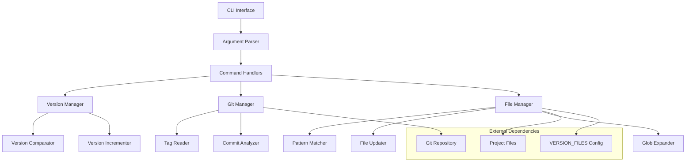

# Design Document

## Overview

The v-and-r (Version and Release Manager) is a Python-based command-line tool that provides automated version management across multiple project files. The tool follows semantic versioning principles (MAJOR.MINOR.PATCH) and integrates with git for comprehensive release management. The design emphasizes simplicity, configurability, and reliability through a single-file implementation with embedded configuration.

## Architecture

### High-Level Architecture



### Core Components

1. **CLI Interface**: Handles command-line argument parsing and user interaction
2. **Version Manager**: Manages semantic version operations (comparison, incrementation)
3. **File Manager**: Handles file discovery, pattern matching, and content updates
4. **Git Manager**: Integrates with git for tag and commit operations
5. **Configuration System**: Embedded VERSION_FILES array for file pattern definitions

## Components and Interfaces

### CLI Interface

```python
class CLIInterface:
    """Main entry point for command-line operations"""
    
    def parse_arguments(self) -> argparse.Namespace:
        """Parse command-line arguments and return parsed namespace"""
        
    def execute_command(self, args: argparse.Namespace) -> int:
        """Execute the appropriate command based on parsed arguments"""
```

**Supported Commands:**
- `--view` / `-v`: Display current versions (default)
- `--patch` / `-p`: Increment patch version
- `--minor` / `-mi`: Increment minor version  
- `--major` / `-ma`: Increment major version
- `--release-info` / `-r`: Generate release information
- `--release-diff` / `-rd`: Show commits between tags
- `--release-last` / `-rl`: Show commits since last tag
- `--release-prepare` / `-rp`: Prepare release documentation
- `--help` / `-h`: Display help information

### Version Manager

```python
class VersionManager:
    """Handles semantic version operations"""
    
    def parse_version(self, version_string: str) -> tuple[int, int, int]:
        """Parse version string into major, minor, patch components"""
        
    def compare_versions(self, version1: str, version2: str) -> int:
        """Compare two semantic versions, return -1, 0, or 1"""
        
    def find_highest_version(self, versions: list[str]) -> str:
        """Find the highest semantic version from a list"""
        
    def increment_patch(self, version: str) -> str:
        """Increment patch version (e.g., v1.2.3 -> v1.2.4)"""
        
    def increment_minor(self, version: str) -> str:
        """Increment minor version and reset patch (e.g., v1.2.3 -> v1.3.0)"""
        
    def increment_major(self, version: str) -> str:
        """Increment major version and reset minor/patch (e.g., v1.2.3 -> v2.0.0)"""
```

### File Manager

```python
class FileManager:
    """Handles file operations and pattern matching"""
    
    def __init__(self, version_files_config: list[dict]):
        """Initialize with VERSION_FILES configuration"""
        
    def expand_file_patterns(self) -> list[str]:
        """Expand glob patterns to actual file paths"""
        
    def find_versions_in_files(self) -> dict[str, str]:
        """Find current versions in all configured files"""
        
    def update_file_version(self, file_path: str, new_version: str) -> bool:
        """Update version in a specific file using its pattern and template"""
        
    def update_all_files(self, new_version: str) -> dict[str, bool]:
        """Update version in all configured files"""
```

### Git Manager

```python
class GitManager:
    """Handles git integration for release management"""
    
    def get_git_tags(self) -> list[str]:
        """Get all git tags sorted by version"""
        
    def get_commits_between_tags(self, tag1: str, tag2: str) -> list[dict]:
        """Get commits between two git tags"""
        
    def get_commits_since_tag(self, tag: str) -> list[dict]:
        """Get commits since a specific tag"""
        
    def get_latest_tag(self) -> str:
        """Get the most recent git tag"""
        
    def is_git_repository(self) -> bool:
        """Check if current directory is a git repository"""
```

### Configuration System

The VERSION_FILES configuration is embedded within the main script:

```python
VERSION_FILES = [
    {
        'file': 'app.py',
        'pattern': re.compile(r'version = "(v\d+\.\d+\.\d+)"'),
        'template': 'version = "{version}"',
    },
    {
        'file': 'README.md', 
        'pattern': re.compile(r'- Version (v\d+\.\d+\.\d+)'),
        'template': '- Version {version}',
    },
    {
        'file': 'dags/*.py',
        'pattern': re.compile(r'Version: (v\d+\.\d+\.\d+)'),
        'template': 'Version: {version}',
    }
]
```

## Data Models

### Version Model

```python
@dataclass
class Version:
    """Represents a semantic version"""
    major: int
    minor: int
    patch: int
    prefix: str = "v"  # Support for 'v' prefix
    
    def __str__(self) -> str:
        return f"{self.prefix}{self.major}.{self.minor}.{self.patch}"
    
    def __lt__(self, other: 'Version') -> bool:
        """Enable version comparison"""
```

### File Configuration Model

```python
@dataclass
class FileConfig:
    """Represents a file configuration entry"""
    file_pattern: str
    regex_pattern: re.Pattern
    template: str
    
    def matches_file(self, file_path: str) -> bool:
        """Check if file path matches this configuration"""
```

### Release Information Model

```python
@dataclass
class ReleaseInfo:
    """Represents release metadata"""
    version: str
    timestamp: str
    commit_hash: str
    commits: list[dict]
    previous_version: str = None
    
    def to_json(self) -> str:
        """Convert to JSON format for version.json"""
```

## Error Handling

### Error Categories

1. **File System Errors**
   - File not found
   - Permission denied
   - Invalid file patterns

2. **Version Parsing Errors**
   - Invalid version format
   - No version found in files
   - Conflicting versions

3. **Git Integration Errors**
   - Not a git repository
   - Invalid git tags
   - Git command failures

4. **Configuration Errors**
   - Invalid regex patterns
   - Missing template placeholders
   - Empty configuration

### Error Handling Strategy

```python
class VAndRError(Exception):
    """Base exception for v-and-r tool"""
    pass

class VersionError(VAndRError):
    """Version-related errors"""
    pass

class FileError(VAndRError):
    """File operation errors"""
    pass

class GitError(VAndRError):
    """Git integration errors"""
    pass
```

**Error Handling Principles:**
- Graceful degradation when git is not available
- Clear error messages with actionable guidance
- Validation of inputs before processing
- Rollback capability for failed file updates

## Testing Strategy

### Unit Testing

1. **Version Manager Tests**
   - Version parsing and comparison
   - Increment operations
   - Edge cases (invalid versions, boundary conditions)

2. **File Manager Tests**
   - Pattern matching accuracy
   - File update operations
   - Glob pattern expansion
   - Template replacement

3. **Git Manager Tests**
   - Tag parsing and sorting
   - Commit history retrieval
   - Error handling for non-git directories

### Integration Testing

1. **End-to-End Command Tests**
   - Full command execution workflows
   - File system integration
   - Git repository integration

2. **Configuration Testing**
   - Various VERSION_FILES configurations
   - Wildcard pattern matching
   - Template formatting

### Test Data Strategy

- Mock git repositories with sample tags and commits
- Sample project files with various version patterns
- Edge case version formats and invalid inputs
- Different file system scenarios

### Testing Tools

- **unittest**: Python standard library testing framework
- **unittest.mock**: For mocking git operations and file system
- **tempfile**: For creating temporary test environments
- **subprocess.mock**: For mocking git command execution

## Implementation Considerations

### Performance Optimizations

1. **Lazy Loading**: Only process files when needed
2. **Caching**: Cache git operations and file reads
3. **Batch Operations**: Update multiple files efficiently
4. **Pattern Compilation**: Pre-compile regex patterns

### Security Considerations

1. **Input Validation**: Sanitize all user inputs
2. **File Path Validation**: Prevent directory traversal
3. **Command Injection**: Secure git command execution
4. **Permission Checks**: Verify file write permissions

### Maintainability Features

1. **Single File Design**: All functionality in one Python file
2. **Clear Separation**: Distinct classes for different concerns
3. **Configuration Driven**: Easy customization through VERSION_FILES
4. **Comprehensive Logging**: Debug information for troubleshooting

### Compatibility Requirements

- **Python 3.8+**: Modern Python features with broad compatibility
- **Cross-platform**: Works on Windows, macOS, and Linux
- **Git Integration**: Compatible with standard git installations
- **No External Dependencies**: Uses only Python standard library